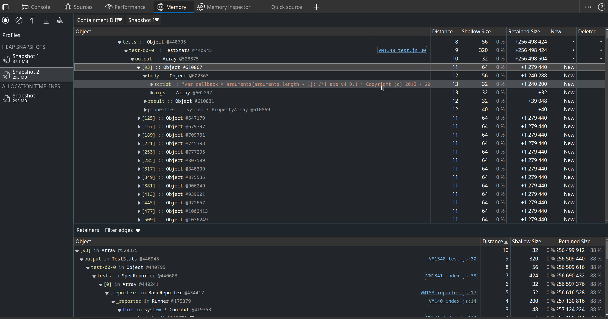

# @axe/webdriverio leak

Simply run `npm install` and then:

```bash
npm run wdio
```

The `wdio.conf.js` already enables `NODE_OPTIONS=--inspect` for the WebdriverIO worker.
Attach a debugger, e.g. via [edge://inspect](chrome://inspect) in Edge or via [chrome://inspect](chrome://inspect) in Chrome, and use allocation instrumentation and heap snapshots to investigate.

## Screenshots



